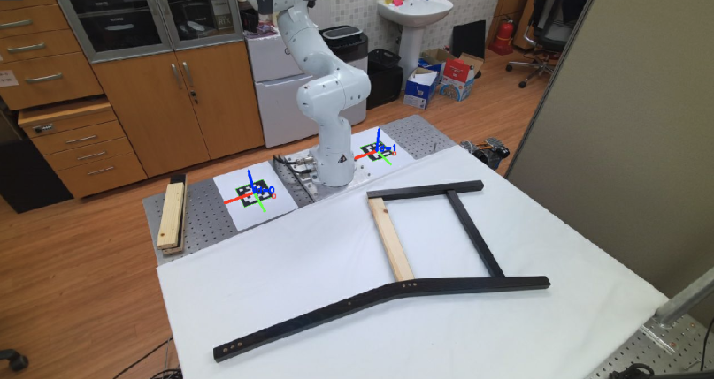
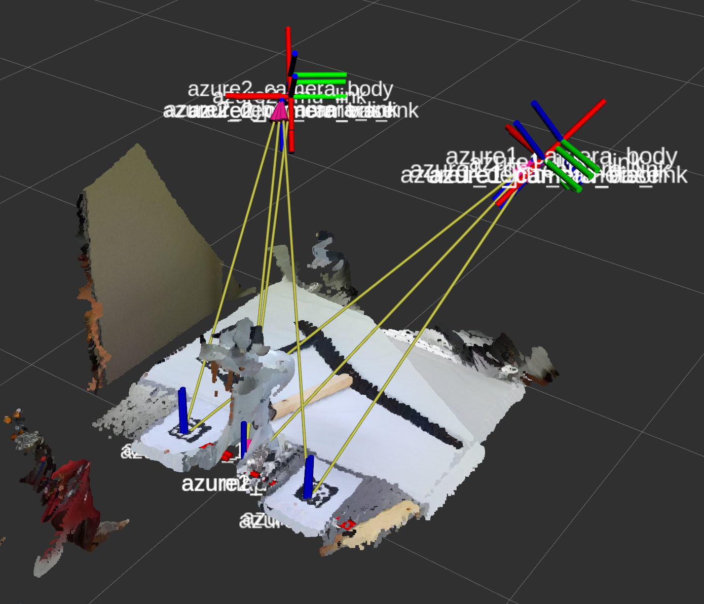

# Assembly Camera Manager

Camera manager for furniture assembly project (Kinect Azure and Zivid) using ArUCO marker

### Features

- Intrinsic & Extrinsic Calibration for Kinect Azure using ArUCO
- tf manager for map and cameras
- receive the sensor value of Zivid and Kinect Azure 

## To Do

- Elaborate intrinsic calibration for accurate point cloud merge and extrinsic calibration (Currently, we are using factory calibrated values)
- merge azure maps and zivid map

## Getting Started

### Prerequisites

- Azure Kinect driver & ROS Wrapper
- Intrinsic Calibration: Azure Kinect python wrapper: https://github.com/brendandburns/py-k4a
- fiducials: sudo apt-get install ros-melodic-fiducials

### Kinect Azure
```
$ roscore 
$ roslaunch azure_kinect_ros_driver driver.launch color_resolution:=1536P depth_mode:=WFOV_UNBINNED
$ python src/deep-furniture-recognition/src/receive_azure.py 
```

### Zivid
```
$ roscore 
$ ROS_NAMESPACE=zivid_camera rosrun zivid_camera zivid_camera_node
$ roslaunch assembly_camera_manager zivid.launch
```

### Intrinsic Calibration

1. Print aruco marker board (imgs/aruco_marker_board.pdf)
2. Capture 50 images of marker board 
```
python src/capture_frame_azure.py {file_name}
```
3. Calibrate the intrinsic parameter 
```
python src/calibrate_azure.py
```

### Extrinsic Calibration for single camera

1. Generate markers (In our case, cv2.aruco.DICT_7X7_50 was used)
```
python scripts/generate_markers.py 
```
2. Print the markers and place it where you want.

3. Launch Kinect Azure driver and auto_detect_slam
```
ROS_NAMESPACE=azure1 roslaunch azure_kinect_ros_driver driver.launch sensor_sn:=000696793812 fps:=5 color_resolution:=720P depth_mode:=WFOV_UNBINNED
roslaunch assembly_camera_manage single_azure.launch
```

### Extrinsic Calibration for multiple camera

```
ROS_NAMESPACE=azure2 roslaunch azure_kinect_ros_driver driver.launch sensor_sn:=000853594412 wired_sync_mode:=2 subordinate_delay_off_master_usec:=160 fps:=5 color_resolution:=720P depth_mode:=WFOV_UNBINNED tf_prefix:=azure2_
ROS_NAMESPACE=azure1 roslaunch azure_kinect_ros_driver driver.launch sensor_sn:=000696793812 wired_sync_mode:=1 fps:=5 color_resolution:=720P depth_mode:=WFOV_UNBINNED tf_prefix:=azure1_
roslaunch assembly_camera_manager double_azure.launch
```




## Authors

* **Seunghyeok Back** [seungback](https://github.com/SeungBack)

## License

This project is licensed under the MIT License

## Acknowledgments

This work was supported by Institute for Information & Communications Technology Promotion(IITP) grant funded by Korea goverment(MSIT) (No.2019-0-01335, Development of AI technology to generate and validate the task plan for assembling furniture in the real and virtual environment by understanding the unstructured multi-modal information from the assembly manual.

## References

- [Aruco_Tracker](https://github.com/njanirudh/Aruco_Tracker)
- Aruco calibration: https://github.com/abhishek098/camera_calibration
- https://www.learnopencv.com/augmented-reality-using-aruco-markers-in-opencv-c-python/


